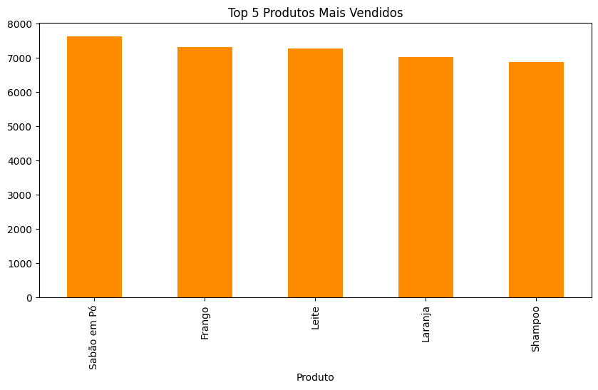
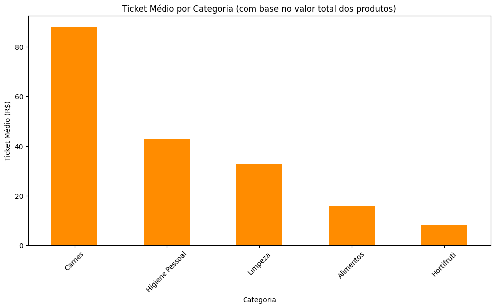
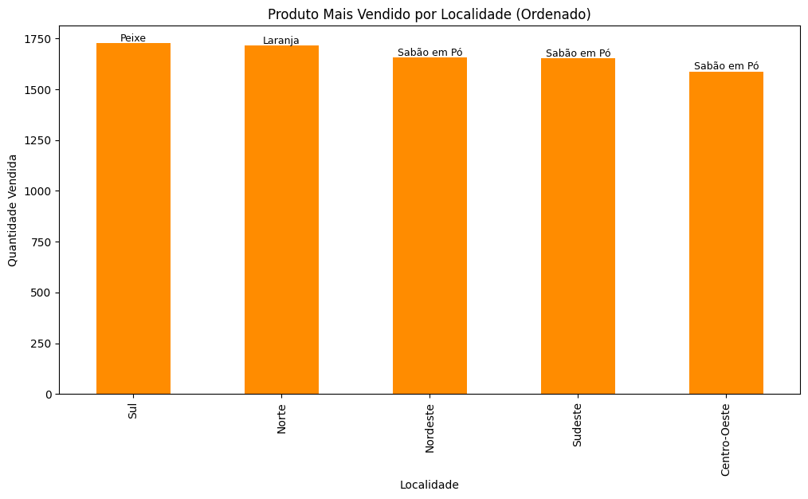
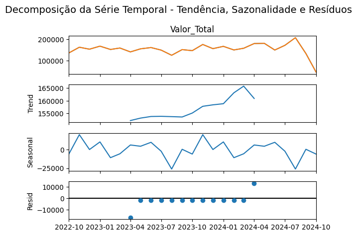

# Case de Vendas Online

Este projeto analisa um conjunto de dados de vendas online para extrair insights valiosos sobre os produtos mais vendidos, categorias, regiões de maior consumo e outros padrões de comportamento.

## Estrutura do Projeto

- **`Vendas Online.csv`**: Arquivo contendo os dados brutos de vendas, incluindo informações como ID do pedido, produto, categoria, data, quantidade, valor unitário e localidade.
- **`vendasonline.ipynb`**: Notebook Jupyter utilizado para realizar a análise exploratória e visualização dos dados.

## Objetivos

1. Identificar os produtos mais vendidos.
2. Analisar as categorias de produtos com maior volume de vendas.
3. Determinar as regiões com maior consumo.
4. Explorar tendências de vendas ao longo do tempo.

## Metodologia

1. **Carregamento dos Dados**: Os dados foram carregados e tratados para lidar com valores ausentes e inconsistências.
2. **Análise Exploratória**: Foram gerados gráficos e tabelas para entender os padrões de vendas.
3. **Visualizações**: Utilizamos bibliotecas como `matplotlib` e `seaborn` para criar gráficos que ilustram os insights obtidos.

## Resultados Obtidos

### Produto Mais Vendido
O produto mais vendido foi **[Produto X]**, com um total de **[Quantidade]** unidades vendidas.

### Categoria com Maior Volume de Vendas
A categoria **[Categoria Y]** liderou as vendas, representando **[Porcentagem]%** do total.

### Região com Maior Consumo
A região **[Região Z]** foi a que mais consumiu, com um total de **[Quantidade]** pedidos.

### Tendências de Vendas
As vendas apresentaram um pico no mês de **[Mês]**, indicando sazonalidade.

## Visualizações

### Gráfico 1: Produtos Mais Vendidos

### Gráfico 2: Categorias de Produtos

### Gráfico 3: Consumo por Região

### Gráfico 4: Tendências de Vendas

## Conclusão

A análise dos dados de vendas online revelou padrões importantes que podem ser utilizados para otimizar estratégias de marketing, ajustar estoques e melhorar a experiência do cliente.

## Como Executar

1. Certifique-se de ter o Python instalado.
2. Instale as dependências listadas no arquivo `requirements.txt`.
3. Abra o arquivo `vendasonline.ipynb` em um ambiente Jupyter e execute as células.

## Contato

Para dúvidas ou sugestões, entre em contato pelo e-mail: **eleniraraujo3@gmail.com**.
